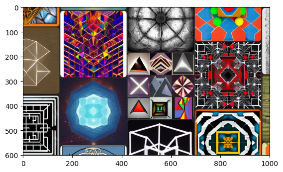

algorithmic-gamer
================

<!-- WARNING: THIS FILE WAS AUTOGENERATED! DO NOT EDIT! -->

algorithmic-gamer is a collection of functionality for making artificial intelligences that can play games. currently built for windows. Vision from any application or a defined region of your screen, collecting observation episodes from gameplay and functionality for enabling your model to interact with the game world. It is still a wip, feel free to submit changes

## How to Install

``` sh
git clone https://github.com/TannerLaBorde/algorithmic-gamer.git
cd algorithmic-gamer
pip install -e '.[dev]'
```

## Example usage

### vision

``` python
reg = Region(left=400, top=400, right=1400, bottom=1000)
img = f_view(reg)
img.shape, plt.imshow(img)
```

    ((601, 1001, 3), <matplotlib.image.AxesImage>)



``` python
win = Window(app_name=fuzzy_app('shannon'))
img2 = f_view(win)
img2.shape, plt.imshow(img2)
```

    ((184, 226, 3), <matplotlib.image.AxesImage>)


``` python
VisualEventObservation(datetime.utcnow(), img).visualize()
```


