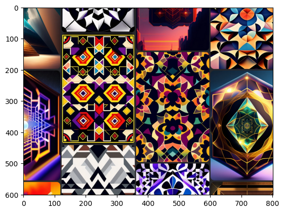

algorithmic-gamer
================

<!-- WARNING: THIS FILE WAS AUTOGENERATED! DO NOT EDIT! -->

algorithmic-gamer is a collection of functionality for making artificial
intelligences that can play games. currently built for windows. Vision
from any application or a defined region of your screen, collecting
observation episodes from game play and enables your model to interact
with the game world. It is still a wip, feel free to submit changes.
this project is built utilizing [nbdev](https://github.com/fastai/nbdev)

## How to Install

``` sh
git clone https://github.com/TannerLaBorde/algorithmic-gamer.git
pip install -e '.[dev]'
```

## Example usage

### vision

#### win32_view region

``` python
reg = Region(left=600, top=400, right=1400, bottom=1000)
img = win32_view(reg)
img.shape, plt.imshow(img)
```

    ((601, 801, 3), <matplotlib.image.AxesImage>)



#### win32_view Window

``` python
win = Window(app_name=fuzzy_app('shannon'))
img2 = win32_view(win)
img2.shape, plt.imshow(img2)
```

    ((184, 261, 3), <matplotlib.image.AxesImage>)


#### dxcam_view

``` python
cam = create_dxcam()
img = dxcam_view(cam, location=reg)
print(f'screencapture of desktop at {reg}')
plt.imshow(img)
```

    screencapture of desktop at Region(left=600, top=400, right=1400, bottom=1000)

    <matplotlib.image.AxesImage>


### sound observation

``` python
audio_sequence = record_audio(duration=3, normalize=True)
plt.plot(audio_sequence.data)
```


### gamepad observation

``` python
record_gamepad_events(3)
```

    [GamepadEventObservation(timestamp=1674069718.6573284, code='ABS_X', state=0.013000885036774804),
     GamepadEventObservation(timestamp=1674069718.6573284, code='ABS_Y', state=-0.02914517654957732),
     GamepadEventObservation(timestamp=1674069718.6573284, code='ABS_RX', state=0.0010681478316599017),
     GamepadEventObservation(timestamp=1674069718.6573284, code='ABS_RY', state=0.03607287820062868),
     GamepadEventObservation(timestamp=1674069718.7843282, code='ABS_X', state=-0.05496383556627094),
     GamepadEventObservation(timestamp=1674069718.7923286, code='ABS_X', state=-0.2919705801568651),
     GamepadEventObservation(timestamp=1674069718.8083282, code='ABS_X', state=-0.5370036927396465),
     GamepadEventObservation(timestamp=1674069718.8083282, code='ABS_Y', state=0.02816858424634541),
     GamepadEventObservation(timestamp=1674069718.8163283, code='BTN_WEST', state=1),
     GamepadEventObservation(timestamp=1674069718.8243287, code='ABS_X', state=-0.7868587298196356),
     GamepadEventObservation(timestamp=1674069718.832328, code='ABS_Y', state=0.10403759880367443),
     GamepadEventObservation(timestamp=1674069718.8403282, code='ABS_X', state=-1.000030518509476),
     GamepadEventObservation(timestamp=1674069718.848328, code='ABS_Y', state=0.1586657307657094),
     GamepadEventObservation(timestamp=1674069718.8803282, code='ABS_Y', state=0.21689504684591204),
     GamepadEventObservation(timestamp=1674069718.9443278, code='BTN_WEST', state=0),
     GamepadEventObservation(timestamp=1674069718.9763281, code='ABS_X', state=-0.9474776451918089),
     GamepadEventObservation(timestamp=1674069718.984328, code='ABS_X', state=-0.7006744590594195),
     GamepadEventObservation(timestamp=1674069719.0003278, code='ABS_X', state=-0.4203314310129093),
     GamepadEventObservation(timestamp=1674069719.016328, code='ABS_X', state=0.0004882961516159551),
     GamepadEventObservation(timestamp=1674069719.016328, code='ABS_Y', state=0.0009155552842799158),
     GamepadEventObservation(timestamp=1674069719.192388, code='ABS_Y', state=-0.06854457228308969),
     GamepadEventObservation(timestamp=1674069719.2003884, code='ABS_Y', state=-0.32364879299295024),
     GamepadEventObservation(timestamp=1674069719.2163885, code='ABS_X', state=0.05896176030762658),
     GamepadEventObservation(timestamp=1674069719.2163885, code='ABS_Y', state=-0.6704000976592304),
     GamepadEventObservation(timestamp=1674069719.2323883, code='ABS_X', state=0.12759788811914427),
     GamepadEventObservation(timestamp=1674069719.2323883, code='ABS_Y', state=-1.000030518509476),
     GamepadEventObservation(timestamp=1674069719.2483888, code='ABS_X', state=0.17777031769768364),
     GamepadEventObservation(timestamp=1674069719.3523881, code='ABS_X', state=0.23184911648915066),
     GamepadEventObservation(timestamp=1674069719.3843882, code='ABS_X', state=0.3053682058168279),
     GamepadEventObservation(timestamp=1674069719.400388, code='ABS_X', state=0.5694143498031556),
     GamepadEventObservation(timestamp=1674069719.4163883, code='ABS_X', state=0.7994018372142705),
     GamepadEventObservation(timestamp=1674069719.4163883, code='ABS_Y', state=-0.7559739982299265),
     GamepadEventObservation(timestamp=1674069719.432388, code='ABS_Y', state=-0.5139622180852688),
     GamepadEventObservation(timestamp=1674069719.4403882, code='ABS_X', state=0.8779869991149633),
     GamepadEventObservation(timestamp=1674069719.4483888, code='ABS_X', state=1.0),
     GamepadEventObservation(timestamp=1674069719.4483888, code='ABS_Y', state=-0.4610431226538896),
     GamepadEventObservation(timestamp=1674069719.4643881, code='ABS_Y', state=-0.2097842341380047),
     GamepadEventObservation(timestamp=1674069719.488388, code='ABS_Y', state=-0.1576281014435255),
     GamepadEventObservation(timestamp=1674069719.5043883, code='ABS_Y', state=-0.10596026490066225),
     GamepadEventObservation(timestamp=1674069719.5203884, code='ABS_Y', state=-0.05258339182714316),
     GamepadEventObservation(timestamp=1674069719.5363884, code='ABS_Y', state=-0.00027466658528397473),
     GamepadEventObservation(timestamp=1674069719.5603883, code='ABS_Y', state=0.07168797875911741),
     GamepadEventObservation(timestamp=1674069719.5763884, code='ABS_Y', state=0.12329477828302866),
     GamepadEventObservation(timestamp=1674069719.5923884, code='ABS_X', state=0.7098910489211707),
     GamepadEventObservation(timestamp=1674069719.5923884, code='ABS_Y', state=0.37879573961607715),
     GamepadEventObservation(timestamp=1674069719.6083882, code='ABS_X', state=0.35813470870082703),
     GamepadEventObservation(timestamp=1674069719.6243885, code='ABS_X', state=0.3077486495559557),
     GamepadEventObservation(timestamp=1674069719.6243885, code='ABS_Y', state=0.4336680196539201),
     GamepadEventObservation(timestamp=1674069719.6403883, code='ABS_X', state=0.2305063020722068),
     GamepadEventObservation(timestamp=1674069719.6483884, code='ABS_X', state=0.021362956633198035),
     GamepadEventObservation(timestamp=1674069719.6883886, code='ABS_X', state=-0.034638508255256814),
     GamepadEventObservation(timestamp=1674069719.6883886, code='ABS_Y', state=0.3681447798089541),
     GamepadEventObservation(timestamp=1674069719.7043881, code='ABS_Y', state=0.30973235267189553),
     GamepadEventObservation(timestamp=1674069719.7283883, code='ABS_Y', state=0.2542802209540086),
     GamepadEventObservation(timestamp=1674069719.8643885, code='BTN_TL', state=1),
     GamepadEventObservation(timestamp=1674069720.0003881, code='ABS_X', state=-0.08511612292855616),
     GamepadEventObservation(timestamp=1674069720.0003881, code='ABS_Y', state=0.2020630512405774),
     GamepadEventObservation(timestamp=1674069720.0243883, code='BTN_TL', state=0),
     GamepadEventObservation(timestamp=1674069720.0243883, code='ABS_X', state=-0.36066774498733484),
     GamepadEventObservation(timestamp=1674069720.0243883, code='ABS_Y', state=0.13077181310464797),
     GamepadEventObservation(timestamp=1674069720.0403886, code='ABS_X', state=-0.4205755790887173),
     GamepadEventObservation(timestamp=1674069720.0403886, code='ABS_Y', state=0.08069093905453657),
     GamepadEventObservation(timestamp=1674069720.0483894, code='ABS_X', state=-0.6642658772545549),
     GamepadEventObservation(timestamp=1674069720.056389, code='ABS_Y', state=0.027344584490493484),
     GamepadEventObservation(timestamp=1674069720.0643883, code='ABS_X', state=-0.9037446211127048),
     GamepadEventObservation(timestamp=1674069720.0723884, code='ABS_X', state=-1.000030518509476),
     GamepadEventObservation(timestamp=1674069720.0723884, code='ABS_Y', state=-0.031006805627613147),
     GamepadEventObservation(timestamp=1674069720.0959613, code='ABS_Y', state=-0.1011078218939787),
     GamepadEventObservation(timestamp=1674069720.1278014, code='ABS_Y', state=-0.16782128360850856),
     GamepadEventObservation(timestamp=1674069720.151959, code='ABS_Y', state=-0.22916348765526293),
     GamepadEventObservation(timestamp=1674069720.1684961, code='ABS_Y', state=-0.2862025818659017),
     GamepadEventObservation(timestamp=1674069720.184366, code='ABS_Y', state=-0.35840937528611105),
     GamepadEventObservation(timestamp=1674069720.192443, code='ABS_X', state=-0.706625568407239),
     GamepadEventObservation(timestamp=1674069720.2004728, code='ABS_Y', state=-0.4303109836115604),
     GamepadEventObservation(timestamp=1674069720.2079825, code='ABS_X', state=-0.29923398541215246),
     GamepadEventObservation(timestamp=1674069720.21598, code='ABS_X', state=-0.06781212805566576),
     GamepadEventObservation(timestamp=1674069720.21598, code='ABS_Y', state=-0.48197882015442367),
     GamepadEventObservation(timestamp=1674069720.2322934, code='ABS_X', state=0.22476882229071932),
     GamepadEventObservation(timestamp=1674069720.2558017, code='ABS_X', state=0.2905362102114933),
     GamepadEventObservation(timestamp=1674069720.2723439, code='ABS_X', state=0.5466475417340617),
     GamepadEventObservation(timestamp=1674069720.2962987, code='ABS_X', state=0.6269417401654103),
     GamepadEventObservation(timestamp=1674069720.3121297, code='ABS_X', state=0.6993011261329997),
     GamepadEventObservation(timestamp=1674069720.32828, code='ABS_X', state=0.9374980925931578),
     GamepadEventObservation(timestamp=1674069720.45628, code='ABS_Y', state=-0.4314706869716483),
     GamepadEventObservation(timestamp=1674069720.48828, code='ABS_X', state=0.6540726950895718),
     GamepadEventObservation(timestamp=1674069720.48828, code='ABS_Y', state=-0.35242774742881555),
     GamepadEventObservation(timestamp=1674069720.4962804, code='ABS_X', state=0.3658558915982543),
     GamepadEventObservation(timestamp=1674069720.4962804, code='ABS_Y', state=-0.086977752006592),
     GamepadEventObservation(timestamp=1674069720.5042806, code='ABS_X', state=0.08880886257515183),
     GamepadEventObservation(timestamp=1674069720.5363126, code='ABS_X', state=0.032624286629841),
     GamepadEventObservation(timestamp=1674069720.5363126, code='ABS_Y', state=-0.03292947172460097),
     GamepadEventObservation(timestamp=1674069720.5676267, code='ABS_X', state=-0.05304116946928312),
     GamepadEventObservation(timestamp=1674069720.5762925, code='ABS_X', state=-0.3271279030732139),
     GamepadEventObservation(timestamp=1674069720.5917993, code='ABS_X', state=-0.6416516617328409),
     GamepadEventObservation(timestamp=1674069720.5917993, code='ABS_Y', state=0.02597125156407361),
     GamepadEventObservation(timestamp=1674069720.6077998, code='ABS_X', state=-0.9058503982665487),
     GamepadEventObservation(timestamp=1674069720.615656, code='ABS_X', state=-1.000030518509476),
     GamepadEventObservation(timestamp=1674069720.631787, code='ABS_Y', state=0.08169804986724448),
     GamepadEventObservation(timestamp=1674069720.6960611, code='ABS_Y', state=0.030365916928617207),
     GamepadEventObservation(timestamp=1674069720.7243893, code='ABS_Y', state=-0.03173924985503708),
     GamepadEventObservation(timestamp=1674069720.7443898, code='ABS_Y', state=-0.10345774712363048),
     GamepadEventObservation(timestamp=1674069720.7683897, code='ABS_Y', state=-0.17139194921720025),
     GamepadEventObservation(timestamp=1674069720.77639, code='ABS_X', state=-0.695974608600116),
     GamepadEventObservation(timestamp=1674069720.79239, code='ABS_X', state=-0.2967925046540727),
     GamepadEventObservation(timestamp=1674069720.79239, code='ABS_Y', state=-0.22315134128849148),
     GamepadEventObservation(timestamp=1674069720.800389, code='ABS_X', state=-0.06451612903225806),
     GamepadEventObservation(timestamp=1674069720.8163898, code='ABS_X', state=-0.011291848506118961),
     GamepadEventObservation(timestamp=1674069720.8323898, code='ABS_X', state=0.051118503372295294),
     GamepadEventObservation(timestamp=1674069720.8403895, code='ABS_X', state=0.2654194769127476),
     GamepadEventObservation(timestamp=1674069720.84839, code='ABS_Y', state=-0.16113773003326518),
     GamepadEventObservation(timestamp=1674069720.8563895, code='ABS_X', state=0.32425916318247017),
     GamepadEventObservation(timestamp=1674069720.8643904, code='ABS_X', state=0.5784173100985748),
     GamepadEventObservation(timestamp=1674069720.88839, code='ABS_X', state=0.652058473464156),
     GamepadEventObservation(timestamp=1674069720.9043903, code='ABS_X', state=0.9312417981505783),
     GamepadEventObservation(timestamp=1674069720.9196818, code='ABS_X', state=1.0),
     GamepadEventObservation(timestamp=1674069721.0639672, code='ABS_X', state=0.7762993255409406),
     GamepadEventObservation(timestamp=1674069721.0799673, code='ABS_X', state=0.3543504135258034),
     GamepadEventObservation(timestamp=1674069721.0799673, code='ABS_Y', state=-0.10800500503555406),
     GamepadEventObservation(timestamp=1674069721.0879676, code='ABS_X', state=0.1446272164067507),
     GamepadEventObservation(timestamp=1674069721.1039672, code='ABS_Y', state=-0.05294961394085513),
     GamepadEventObservation(timestamp=1674069721.111968, code='ABS_X', state=0.08752708517715994),
     GamepadEventObservation(timestamp=1674069721.1439676, code='ABS_X', state=0.027222510452589496),
     GamepadEventObservation(timestamp=1674069721.1679676, code='ABS_X', state=-0.03991821039460433),
     GamepadEventObservation(timestamp=1674069721.1759684, code='ABS_X', state=-0.3051850947599719),
     GamepadEventObservation(timestamp=1674069721.1759684, code='ABS_Y', state=0.004638813440351573),
     GamepadEventObservation(timestamp=1674069721.1917138, code='ABS_X', state=-0.543473616748558),
     GamepadEventObservation(timestamp=1674069721.2077131, code='ABS_X', state=-0.597674489577929),
     GamepadEventObservation(timestamp=1674069721.215714, code='ABS_X', state=-0.8315073091830195),
     GamepadEventObservation(timestamp=1674069721.2317135, code='ABS_X', state=-1.000030518509476),
     GamepadEventObservation(timestamp=1674069721.2477133, code='ABS_Y', state=0.05639820551164281),
     GamepadEventObservation(timestamp=1674069721.3117132, code='ABS_Y', state=0.0059511093478194525),
     GamepadEventObservation(timestamp=1674069721.3437157, code='ABS_Y', state=-0.06772057252723777),
     GamepadEventObservation(timestamp=1674069721.3517156, code='ABS_X', state=-0.6306649983214819),
     GamepadEventObservation(timestamp=1674069721.3597157, code='ABS_X', state=-0.3218787194433424),
     GamepadEventObservation(timestamp=1674069721.3597157, code='ABS_Y', state=-0.32236701559495834),
     GamepadEventObservation(timestamp=1674069721.3677154, code='ABS_X', state=-0.017334513382366405),
     GamepadEventObservation(timestamp=1674069721.3757162, code='ABS_X', state=0.20819727164525284),
     GamepadEventObservation(timestamp=1674069721.3917687, code='ABS_X', state=0.6315805536057619),
     GamepadEventObservation(timestamp=1674069721.4077132, code='ABS_X', state=0.9695730460524308),
     GamepadEventObservation(timestamp=1674069721.4077132, code='ABS_Y', state=-0.3846247749259926),
     GamepadEventObservation(timestamp=1674069721.455713, code='ABS_Y', state=-0.434858241523484),
     GamepadEventObservation(timestamp=1674069721.5197136, code='ABS_X', state=0.6572161015655995),
     GamepadEventObservation(timestamp=1674069721.5197136, code='ABS_Y', state=-0.15701773125400556),
     GamepadEventObservation(timestamp=1674069721.5277135, code='ABS_X', state=0.38023010956144904),
     GamepadEventObservation(timestamp=1674069721.5357153, code='ABS_X', state=0.1174962614825892),
     GamepadEventObservation(timestamp=1674069721.5357153, code='ABS_Y', state=0.11978514969328898),
     GamepadEventObservation(timestamp=1674069721.551714, code='ABS_Z', state=0.09019607843137255),
     GamepadEventObservation(timestamp=1674069721.5677137, code='ABS_Z', state=0.27450980392156865),
     GamepadEventObservation(timestamp=1674069721.5757136, code='ABS_Z', state=0.39215686274509803),
     GamepadEventObservation(timestamp=1674069721.5837133, code='ABS_Z', state=0.5568627450980392),
     GamepadEventObservation(timestamp=1674069721.5837133, code='ABS_X', state=0.05557420575579089),
     GamepadEventObservation(timestamp=1674069721.591714, code='ABS_Z', state=0.7764705882352941),
     GamepadEventObservation(timestamp=1674069721.591714, code='ABS_Y', state=0.18305001983703115),
     GamepadEventObservation(timestamp=1674069721.599713, code='ABS_Z', state=0.9725490196078431),
     GamepadEventObservation(timestamp=1674069721.6077144, code='ABS_X', state=-0.1934873500778222),
     GamepadEventObservation(timestamp=1674069721.6077144, code='ABS_Y', state=0.4597003082369457),
     GamepadEventObservation(timestamp=1674069721.6237137, code='ABS_X', state=-0.44157231360820337),
     GamepadEventObservation(timestamp=1674069721.631713, code='ABS_Y', state=0.532578508865627),
     GamepadEventObservation(timestamp=1674069721.6397138, code='ABS_X', state=-0.7310708944975127),
     GamepadEventObservation(timestamp=1674069721.6477134, code='ABS_Y', state=0.5970030823694571)]
